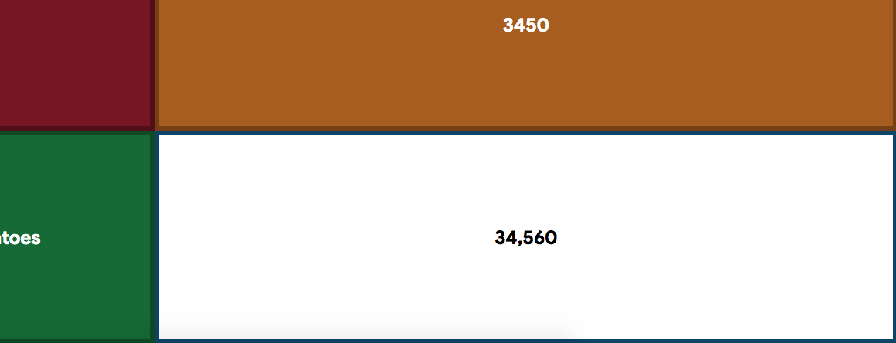
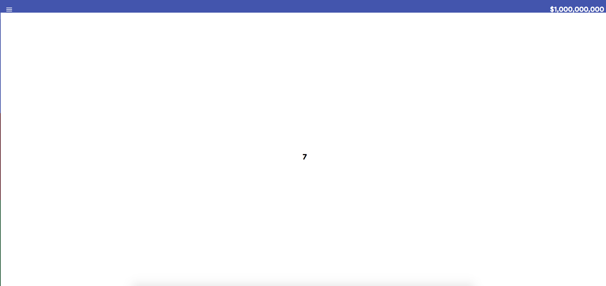
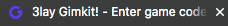
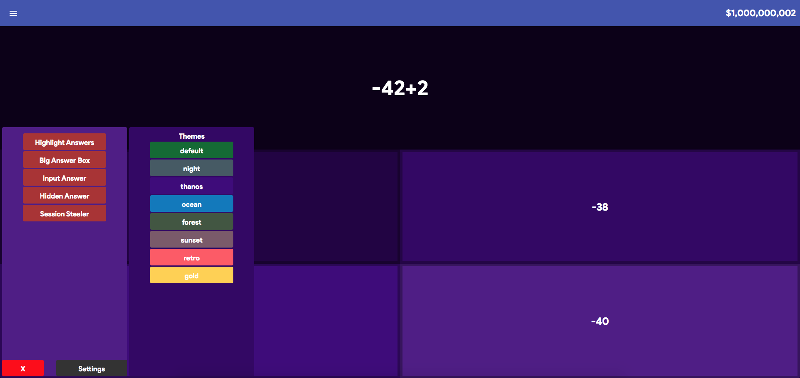
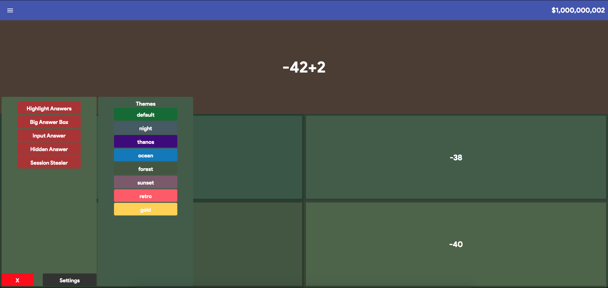
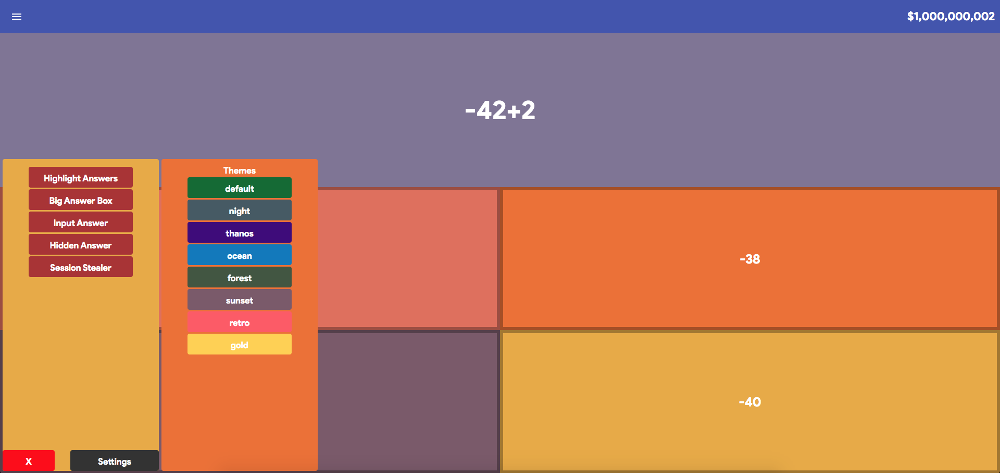
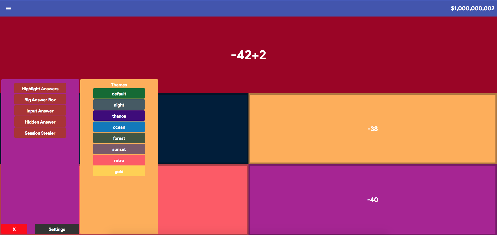
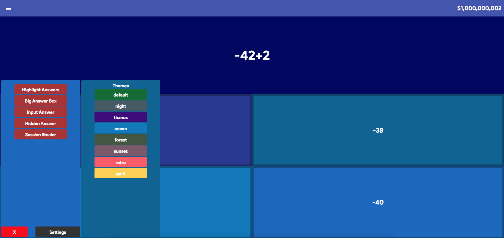

# [Gimkit](gimkit.js) *V1.7.20-1*

#### It is against Gimkit's [terms of service](https://www.gimkit.com/terms-of-service#integrity-of-the-game-and-community) to cheat/hack in gimkit matches. Doing so can lead to account termination. *Do At Your Own Risk*

## *News!*
```diff
+ [1/20] I was able to maintain a 1.0 QPS without getting kicked. Then I started to spam and got up to 1.5 QPS before I got kicked.

+ [1/13] Highlight Answer, and all the others are now fully WORKING AGAIN! No need to get the answer wrong anymore! Works Just Like Before
  
- [1/13] Gimkit has implemented new detection to protect against scripts. To make sure you do not get kicked, try not to answer too quickly, as you will get kicked for that. You will probably eventually get kicked for scripts detected, as I do not know how it detects the scripts, yet
```

## Features:
#### Highlight Answer
- Highlights the correct answer in a nice bold white color



#### Input Answers
- Simply inputs the correct answer into those type questions that are annoying
> **NOTE:** Requires an update to the box (space, then enter)
#### Bigger Answer
- Makes the selection box of the correct answer the entire screen



#### Hidden Answer
- Hides the correct answer in a number, in the title of the current tab



#### Keybinds
- Keys: Hide Menu > C
- Highlight > H
- Big Answer > B
- Input Answer > I
- Hidden Answer > O

#### Applying Themes Without Buying Them
- Show off.



#### Session Stealer
- Allows you to steal the session of any other player in the Gimkit match
> **NOTE:** You'll need the users Blueboat ID, and nobody can be connected to the ID

#### Upgrade Update
- Shows you the next upgrade $ amount and will be colored green if you can buy the upgrade
> **NOTE:** You'll have to open the shop to each category so it knows what level's you have

#### Questions Per Second
- Shows you how many questions you are answering every second.
- When the text turns *red* than you are at risk of getting kicked.

## Usage:
#### Developer Console
- Copy & Paste [gimkit.js](gimkit.js) **or** Bookmarklet *(Below)* and remove `javascript:` & `void 0`
#### Bookmarklet (AUTO-UPDATING)
- *Lastest* - Copy & Paste the script below into a bookmark:

```javascript
javascript:(function(){let lscrpt=document.createElement("script");lscrpt.src="https://undercovergoose.github.io/quizlet/gimkit/gimkit.js";document.body.appendChild(lscrpt);}());void 0
```

> **NOTE:** My site happens to be *"Dangerous"* so you'll have to click *"Visit this unsafe site"* to run the cheats or copy the script below

- *Recommended* - (Not Live) Stable Release **Not Dangerous!** `*running v1.7.20-1*`

```javascript
javascript:(function(){let lscrpt=document.createElement("script");lscrpt.src="https://undercovermoose.github.io/gimkitjs/gimkit.js";document.body.appendChild(lscrpt);}());void 0
```

## Upcoming Features:
- Changing of keybinds
- Alerting when your QPS is to high

## Features Not Worthy Enough
- *Impossible*
  - Stealing the session of a player currently in the GimKit
  - Purchasing Upgrades without visiting the shop
- *Denied*
  - None

## [Technical Explanation](technical/README.md)
